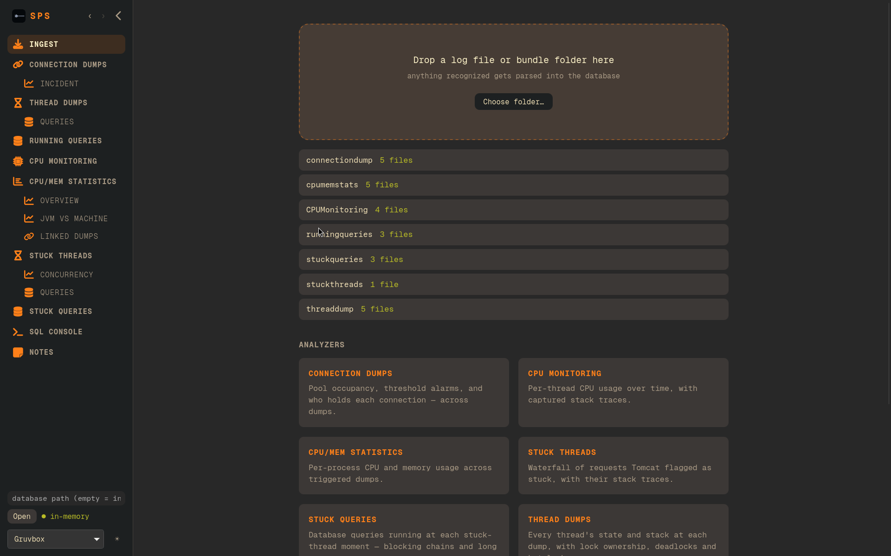
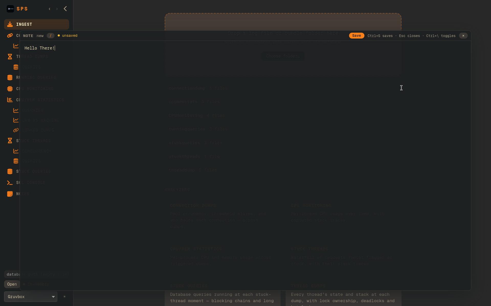

# SPS

Linux/Windows/MacOS GUI Application to analyze stability-performance-scalability logs, powered by Rust, Svelte, DuckDB and WebKit!

Hand-Written FSM-powered, single-pass, zero-copy, multi-threaded parser that can purely parse logs totalling 1GB in 0.2s, and persists the entire result under a second.






# Usage

```bash
sps --help

# Usage: sps [COMMAND]

# Commands:
# parse   Parses the performance logs in `path` and persists it to --database
# launch  Launches the GUI with the --database
# query   Executes a `query` against --database and serializes result to `stdout` as json
# schema  Prints the schema of the `database` to `stdout` in json
# help    Print this message or the help of the given subcommand(s)

# Options:
#  -h, --help  Print help

sps parse # Attempts to find sps logs in the current working directory, parses it and keeps the result in memory.
sps parse -d foo.db # Attempts to find sps logs in the current working directory, parses it and persists the results in foo.db
sps parse path/to/sps/directory -d foo.db # Attempts to parse path/to/sps/directory and persists the results in foo.db

sps schema foo.db # Prints the schema and statistics of the logs, helpful for discovery with agents
sps query "SELECT 1" -d foo.db # Prints the results of the query as json
sps query "SELECT * FROM threaddump" -d foo.db --export threaddump.csv # Exports the result of the query to the CSV file
sps query "SELECT * FROM threaddump" -d foo.db --limit 10 --offset 10 # Explicit pagination of query result

sps launch # Launches the GUI, where you can parse a directory chosen from your file picker
sps launch -d foo.db # Launches the GUI with the results from the db
```

# Installation

## Ubuntu

1. Download the matching .deb for your Ubuntu version from [releases](https://github.com/bakageddy/sps/releases)
2. Execute the following command

```bash
curl -OL https://github.com/bakageddy/sps/releases/download/v2026.10.5/sps_2026.10.5_amd64_ubuntu-24.04.deb
sudo apt install ./sps_2026.10.5_amd64_ubuntu-24.04.deb
```

3. Open the Application from desktop or Launch it from command line with

```bash
sps launch
# or
sps
```

## MacOS M-Series

1. Download the .dmg file by copying the link from [releases](https://github.com/bakageddy/sps/releases) and executing:

```bash
curl -OL https://github.com/bakageddy/sps/releases/download/v2026.10.5/sps_2026.10.5_aarch64.dmg
```

2. Install either by using `open` in a terminal or with `finder`.

## Windows
1. Download the appropriate setup.exe file from [releases](https://github.com/bakageddy/sps/releases)
2. Run the setup artifact

# Contributing

0. Strictly no AI on the rust based code, however the frontend is your playground
1. Recommended IDE Setup

[VS Code](https://code.visualstudio.com/) + [Svelte](https://marketplace.visualstudio.com/items?itemName=svelte.svelte-vscode) + [Tauri](https://marketplace.visualstudio.com/items?itemName=tauri-apps.tauri-vscode) + [rust-analyzer](https://marketplace.visualstudio.com/items?itemName=rust-lang.rust-analyzer).
